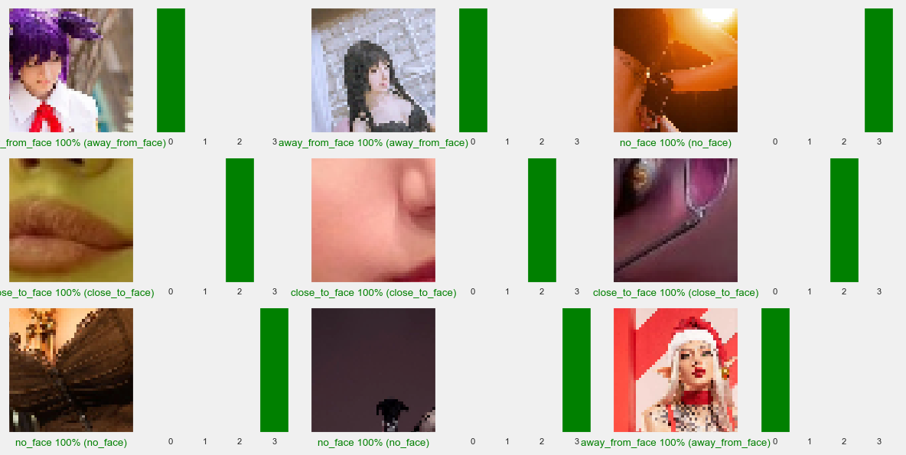
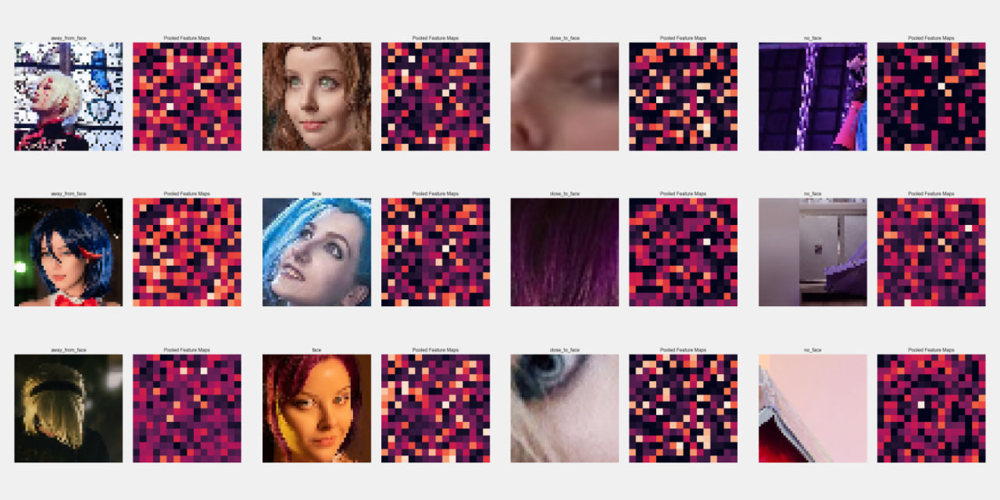

# Face Recognition

This repository contains a Jupyter notebook (`face-recognition.ipynb`) that provides a comprehensive guide for performing face recognition task. The notebook covers various steps such as dataset preprocessing, data loading, model creation and training, evaluation, and more.

## Models

The repository includes several pre-trained models that can be used for face recognition:

- `face-recognition_s32_p217K.h5`: This model predicts whether a given image contains a face or not.
- `face-recognition_s48_p1.2M.h5`: This model predicts whether a face is located away from the camera, close to the camera, or not present in the image.
- `face-recognition_s48_p2.1M.h5`: This model is similar to the previous one, but it uses global average pooling after features extraction layers.

## Results

The `results` folder contains visual result of models:

- This file contains plots with images and their corresponding predictions using the pre-trained models.

- This file includes plots with images and their feature maps after the global average pooling layer.

## Request for Dataset

To access the dataset and contribute to the face recognition project, please fill out the [Dataset Request Form](https://forms.gle/hWRRn9nyALxHxwap6) with the following information:

1. Name: Provide your full name.
2. Email: Enter your email address where I can reach you.
3. Purpose: Briefly describe the purpose or intended use of the dataset.

Once you submit the form, I will review your request and get in touch with you regarding dataset access.

## Description of `face-recognition.ipynb`

The `face-recognition.ipynb` notebook offers a step-by-step guide for performing face recognition task. It covers the following main sections:

1. Preprocessing the dataset: This section describes the necessary steps to preprocess the face recognition dataset, including data cleaning, normalization, and augmentation if needed.
2. Loading the data: This section demonstrates how to load the preprocessed dataset into the notebook.
3. Creating and training the model: This section provides code examples for creating the face recognition model using a CNN architecture and training it using the loaded dataset.
4. Evaluation and analysis: This section shows how to evaluate the trained model, analyze its performance metrics, and generate predictions for new images.

Feel free to explore the notebook and adapt it to your specific requirements. Enjoy experimenting with face recognition using the provided models and tools!

If you have any questions or encounter any issues, please don't hesitate to reach out.

**Note**: The pre-trained models and results mentioned above are just examples and can be replaced with your own models and outputs for further experimentation and analysis.
